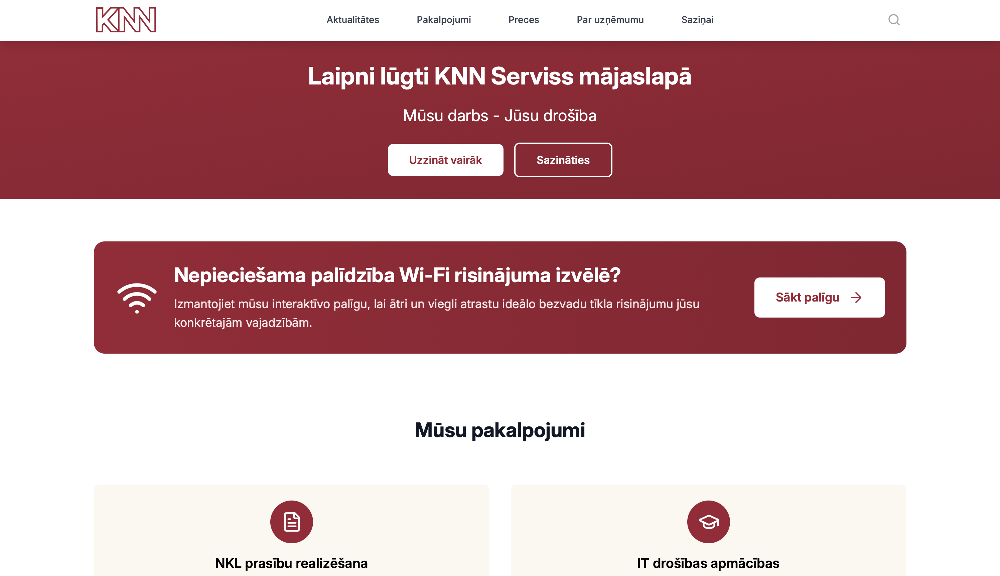
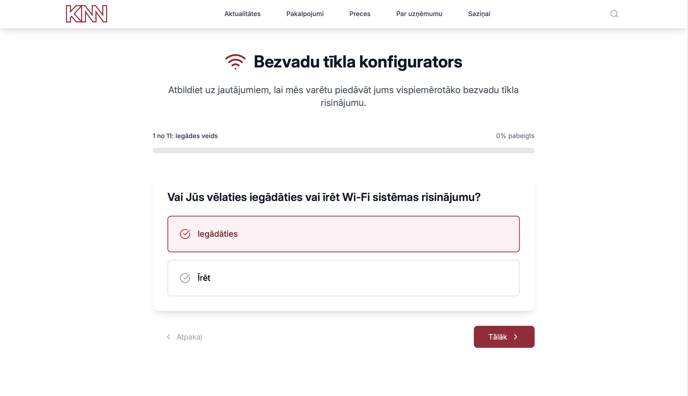
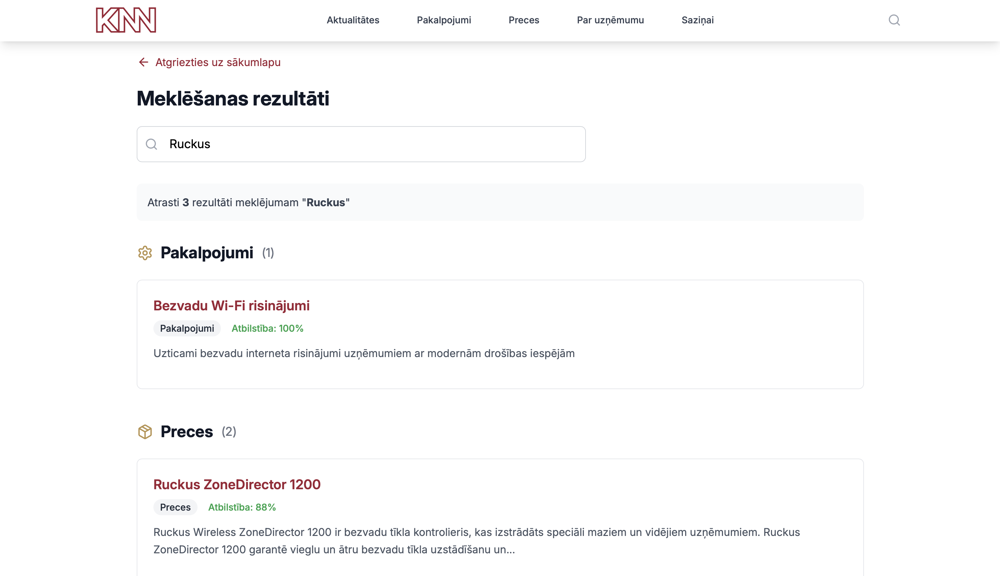
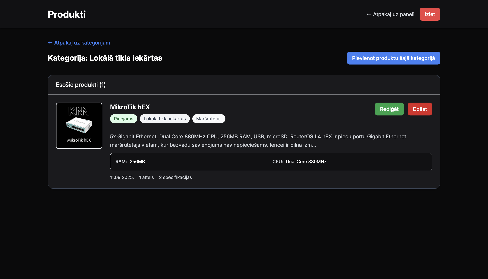

# KNN Serviss website

The public website for SIA KNN Serviss, a cybersecurity and IT services company in Latvia.

## Features

- Responsive React+Tailwind CSS frontend with TypeScript and Vite.
- Node.js/Express backend with a SQLite database and JWT-based authentication.
- Interactive WiFi device recommendation quiz
- Site-wide search with Fuse.js
- CMS for managing products and news articles, with file/image upload support.
- Contact form integration
- Analysis tracking with Google Analytics
- Currently deployed on a self-hosted server environment with Nginx reverse proxy, PM2 process manager, SSL/TLS encryption.

## Tech Stack

- **Frontend:** React with TypeScript, Vite, TailwindCSS
- **Backend:** Node.js + Express.js, Typescript, SQLite, JWT authentification, bcrypt
- **Key Libraries:** Lucide React (icons), CORS & Helmet (security), Morgan (logging)

## Screenshots

